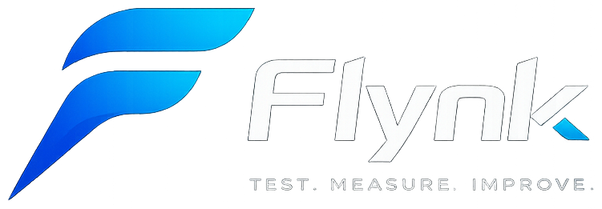
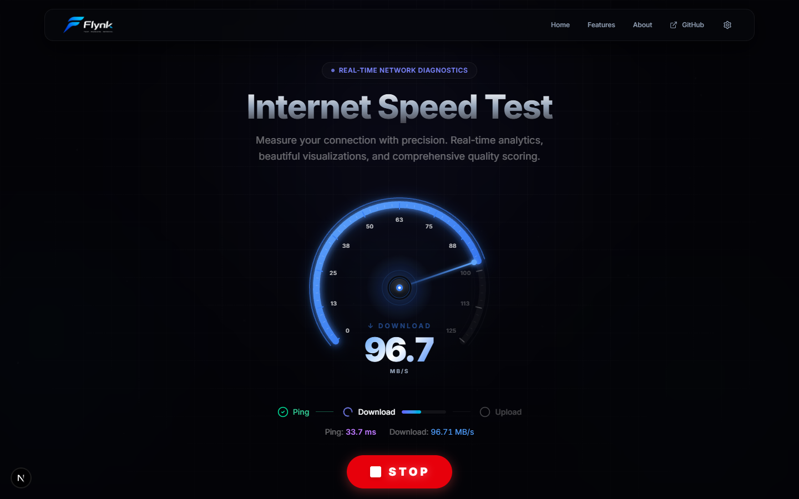

<p align="center">
  
</p>

<h1 align="center">Flynk - Internet Speed Test</h1>

<p align="center">
  <strong>A premium, modern, open-source internet speed test application built with Next.js, Framer Motion, and Tailwind CSS.</strong>
</p>

<p align="center">
  <a href="https://github.com/sam-eer31/internet_speed_test/blob/main/LICENSE">
    
  </a>
  <a href="https://github.com/sam-eer31/internet_speed_test/stargazers">
    
  </a>
  <a href="https://github.com/sam-eer31/internet_speed_test/forks">
    
  </a>
  <a href="https://vercel.com">
    
  </a>
</p>

<p align="center">
  <a href="https://github.com/sam-eer31/internet_speed_test" target="_blank" rel="noopener noreferrer">
    
  </a>
</p>

---

Flynk is a beautifully designed, highly interactive, and privacy-first internet speed test client. Leveraging edge testing nodes and modern web technologies, Flynk provides accurate real-time metrics with a state-of-the-art interface that feels responsive, interactive, and premium.

### 🌐 Live Demo
Run your speed test instantly: **[flynk-speedtest.vercel.app](https://github.com/sam-eer31/internet_speed_test)** *(You can customize this to link directly to your deployed production URL)*

---

## 📸 Screenshots

<p align="center">
  
</p>

---

## ✨ Key Features

- **⚡ Precision & Speed:** Real-time download and upload measurements using Tier-1 high-performance Cloudflare edge endpoints and Google GGC servers.
- **🎨 Glassmorphic Interface:** A stunning dark/light dashboard styled with HSL tailored indigo and cyan gradients, smooth Framer Motion animations, and a dynamic real-time Speed Gauge.
- **📈 Real-Time Charts:** Live-updating network performance tracking graphs powered by Recharts.
- **🎮 Real-World Use-Case Ratings:** Intelligent analytics rating your connection quality for specific online tasks:
  - **Online Gaming:** Latency and jitter optimization assessment.
  - **Video Calling:** Buffer-free meetings on Zoom, Teams, and Google Meet.
  - **Browsing Quality:** Social media loading and web page responsiveness.
  - **4K UHD Streaming:** Bandwidth check for high-resolution streaming.
- **🔒 Privacy-Focused Device & Network Info:** Accurate extraction of user OS, browser engine, and ISP using verified HTTP headers via `ua-parser-js` without tracking.
- **📸 Scorecard Sharing:** Generate and export a custom, styled PNG scorecard of your speed test results with one click.
- **🎛️ Customization:** Toggle between Light and Dark themes, and switch easily between Bit (Mbps) and Byte (MB/s) measuring units.

---

## 🛠️ Tech Stack

- **Framework:** [Next.js 16 (App Router)](https://nextjs.org/)
- **Styling:** [Tailwind CSS v4](https://tailwindcss.com/)
- **Animations:** [Framer Motion](https://motion.dev/)
- **Charts:** [Recharts](https://recharts.org/)
- **Icons:** [Lucide React](https://lucide.dev/)
- **Analytics:** [UA-Parser-JS](https://github.com/faisalman/ua-parser-js)

---

## 🚀 Getting Started

To run Flynk locally on your machine, follow these simple setup steps.

### Prerequisites

Ensure you have **Node.js** (v18.x or later) and **npm** installed.

### Installation

1. **Clone the repository:**
   ```bash
   git clone https://github.com/sam-eer31/internet_speed_test.git
   cd internet_speed_test
   ```

2. **Install dependencies:**
   ```bash
   npm install
   ```

3. **Run the development server:**
   ```bash
   npm run dev
   ```

4. **Open in browser:**
   Navigate to [http://localhost:3000](http://localhost:3000) to see Flynk running locally.

### Production Build

To build the project for production deployment:
```bash
npm run build
npm start
```

---

## 🤝 Contributing

Contributions make the open-source community an amazing place to learn, inspire, and create. Any contributions you make are **greatly appreciated**.

1. Fork the Project
2. Create your Feature Branch (`git checkout -b feature/AmazingFeature`)
3. Commit your Changes (`git commit -m 'Add some AmazingFeature'`)
4. Push to the Branch (`git push origin feature/AmazingFeature`)
5. Open a Pull Request

---

## 📄 License

Distributed under the MIT License. See `LICENSE` for more information.

---

<p align="center">
  Built with 💙 by Flynk Contributors
</p>
